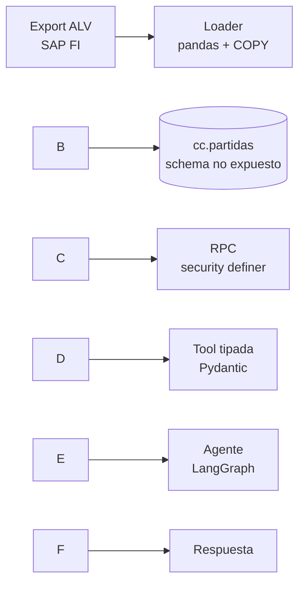

# Agente de consulta de cuenta corriente de proveedores (SAP FI)

Consulta en lenguaje natural sobre partidas abiertas de acreedores. La lógica de
negocio vive en Postgres; el LLM solo traduce la pregunta a parámetros tipados y
redacta la respuesta sobre datos que no calculó él.

> Datos anonimizados de un export ALV real de SAP FI (partidas de acreedor).
> El repo no incluye datos.

\---

## El problema

Responder "¿cuánto le debo vencido al proveedor X?" requiere entrar a SAP, correr
la transacción, filtrar y sumar a mano. La pregunta se repite decenas de veces por
mes y siempre en la misma forma.

La tentación es conectar un LLM directo a la tabla y dejar que arme la query. Eso
falla por tres lados: el modelo inventa la regla de negocio, trae cientos de filas
al contexto, y expone la tabla entera a quien tenga la clave.

Este proyecto hace lo contrario: **una sola función SQL como superficie, con la
lógica de negocio adentro y el LLM afuera.**

\---

## Arquitectura



|Capa|Qué hace|
|-|-|
|Loader|Excel → Postgres vía `COPY`. Limpia artefactos del ALV y reconcilia contra el total de SAP|
|Base|Tabla en el schema `cc`, fuera de los schemas expuestos por PostgREST|
|RPC|Filtra, agrega por moneda y calcula aging. Devuelve JSON compacto|
|Tool|Contrato de 5 parámetros tipados con Pydantic|
|Agente|LangGraph sobre la tool. Proveedor de LLM intercambiable por variable de entorno|

\---

## Decisiones y trade-offs

### La agregación va en SQL, no en el contexto del LLM

Un acreedor puede tener cientos de partidas. Traerlas al contexto para que el
modelo sume es caro, lento y propenso a error aritmético.

El RPC devuelve saldos por moneda y aging por tramo (`por\_vencer`, `0\_30`,
`31\_60`, `61\_90`, `mas\_90`, `sin\_vencimiento`). El detalle fila a fila es
`incluir\_partidas=False` por defecto y tiene tope duro de 200.

**Trade-off:** preguntas fuera de los agregados previstos no se pueden responder
sin tocar el SQL. Es deliberado — la alternativa es text-to-SQL, que gana
flexibilidad y pierde toda garantía sobre la regla de negocio.

### RPC en lugar de los filtros de PostgREST

PostgREST expone filtros por URL gratis. Usarlos implicaría que el modelo
construya `?proveedor\_id=eq.0000002824\&fecha\_compensacion=is.null` y que la regla
"abierta = sin compensar" viva en el prompt.

Con RPC la regla vive en SQL. El modelo elige entre cinco parámetros con tipos y
descripciones, no arma sintaxis.

### La tabla está en un schema no expuesto, no solo protegida por RLS

PostgREST solo sirve los schemas listados en *Exposed schemas*. La tabla vive en
`cc`, que no está en esa lista: **es inalcanzable por REST por construcción, no
por policy.**

RLS queda como segunda capa por si alguien expone `cc` en el futuro. La función
está en `public` (expuesto) y lee de `cc` con `security definer` y
`search\_path = ''`.

Verificación de que el modelo cierra:

```sql
set role anon;
select \* from cc.partidas;   -- ERROR: permission denied for schema cc
select public.cuenta\_corriente\_proveedor('2824', true, false, false, 5);  -- OK
```

**Trade-off:** más piezas que un `enable row level security` con una policy. A
cambio, el error de configuración más común de Supabase —olvidar la policy— no
expone nada.

### Acreedor sin partidas devuelve 200, no 404

Un conjunto vacío no es un recurso inexistente. Con 404 el modelo concluye "el
proveedor no existe" y alucina.

* Acreedor fuera del maestro → `{"error": "acreedor\_inexistente"}`
* Acreedor existe, sin partidas bajo esos filtros → `cantidad\_partidas: 0`

Son dos estados distintos y el docstring de la tool se lo dice al modelo de forma
explícita.

### El proveedor de LLM es configuración, no código

`llm.py` construye el modelo desde `LLM\_PROVIDER`. Cambiarlo es una línea del
`.env`. La decisión de si conviene se toma con el eval, no de oído.

\---

## Calidad de datos: el export de SAP no es tabular

Los ALV traen dos artefactos que producen el mismo síntoma —`proveedor\_id` vacío—
y se resuelven al revés uno del otro:

|Fila|Tiene documento/fechas|Acción|Por qué|
|-|-|-|-|
|Subtotal de grupo|No|Descartar|Es la suma del grupo. Cargarla duplica el saldo|
|Repetición suprimida|Sí|Propagar el acreedor anterior|Es una partida real; SAP imprime el número solo en la primera fila|

Un `ffill` sobre la columna entera parece la solución obvia y es incorrecto:
también rellena las filas de subtotal, que entonces sobreviven al descarte.

Detalle relacionado: los códigos (`clave\_referencia`, `cuenta\_contrapartida`)
salen de Excel como float y llegan con `.0` pegado. Se fuerzan a texto desde la
lectura, no después — un código de 14 dígitos leído como `float64` pierde
precisión antes de que se lo pueda limpiar.

**Control de carga:** el loader imprime el total por moneda y debe coincidir al
centavo con la fila de total del ALV. Es la única forma de saber que la limpieza
no descartó de más ni de menos.

\---

## Evaluación

`eval\_tool\_calls.py` mide lo único que puede fallar del lado del modelo: si
extrae bien los argumentos. Siete casos en castellano rioplatense con los
argumentos esperados, mockeado — no pega contra la base y cuesta centavos.

```
python eval\_tool\_calls.py
```

Los casos que discriminan:

* *"¿tiene algo vencido sin pagar?"* → tiene que activar dos flags a la vez
* *"traeme las primeras 10"* → `limit=10` **y** `incluir\_partidas=True`
* *"qué antigüedad tiene la deuda"* → NO debe pedir el detalle; el aging ya viene

Es lo que convierte "¿me sirve el modelo X?" en un número comparable.

<!-- TODO: pegar los resultados reales del eval por proveedor de LLM -->

\---

## Limitaciones conocidas

* **Un acreedor por consulta.** No responde "los 10 proveedores con más deuda
vencida". Requiere un RPC de ranking; no está implementado.
* **Solo por número de acreedor.** No hay resolución por nombre — el export no
trae la denominación del proveedor.
* **Sin memoria conversacional.** Cada pregunta arranca de cero. Es deliberado
(costo plano, contexto acotado); agregarla es sumar un checkpointer.
* **Carga full-refresh.** `truncate` y recarga completa en cada corrida.
* **Orquestación con prebuilt.** Usa `create\_react\_agent`, no un `StateGraph`
propio. La consecuencia real: la distinción "acreedor inexistente vs. sin
partidas" es una instrucción de prompt en lugar de un edge del grafo.

\---

## Stack

Postgres (Supabase) · PostgREST · Python 3.12 · pandas · psycopg 3 · LangGraph ·
LangChain · Anthropic API

## Puesta en marcha

Ver [SETUP.md](SETUP.md).

